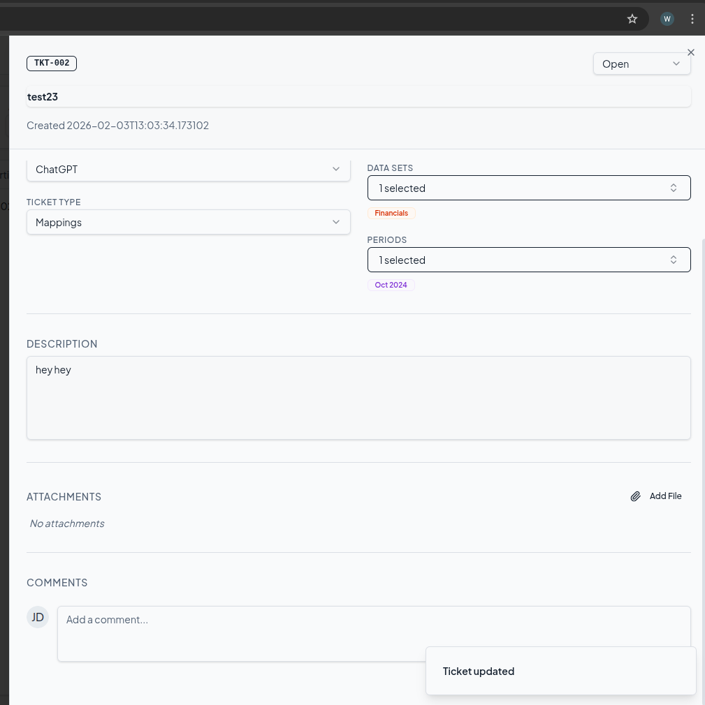

## 1. List Shares (Shared By Me)

**Endpoint:** `GET /api/vision/clip-reels/shared-by-me/`

**Purpose:** Get all clip reels you have shared with others

**Authentication:** Required (Bearer Token)

**Response:**
```json
{
  "shares": [
    {
      "id": 1,
      "clip_reel": 55,
      "shared_with_user": {
        "id": "f84a76b5-91f3-4842-b520-1af2d492997c",
        "name": "Rawad ISMAEEL",
        "role": "Player",
        "jersey_number": 8
      },
      "can_comment": true,
      "shared_at": "2026-01-14T10:30:00Z"
    }
  ]
}
```

**cURL Example:**
```bash
curl --location 'http://127.0.0.1:8003/api/vision/clip-reels/shared-by-me/' \
  --header 'Authorization: Bearer YOUR_TOKEN'
```

---

## 2. List Shares (Shared With Me)

**Endpoint:** `GET /api/vision/clip-reels/shared-with-me/`

**Purpose:** Get all clip reels that have been shared with you, grouped by the user who shared them. This endpoint organizes shared content by sharer, making it easy to see what each person has shared with you.

**Authentication:** Required (Bearer Token)

**Query Parameters:** None

**Response (200 OK):**
```json
[
  {
    "shared_by": {
      "id": "2e921a52-a38f-40ed-98ef-1dfcf2982a1e",
      "name": "Binyamin MOGILOVSKI",
      "phone_no": "+919506218202",
      "role": "Coach",
      "jersey_number": null
    },
    "clip_reels": [
      {
        "trace_vision_id": 36,
        "highlight_id": 10,
        "clip_id": 55,
        "url": "https://example.com/video.mp4",
        "ratio": "original",
        "event_type": "goal",
        "event_name": "Goal at 19:00",
        "label": "Goal - Home",
        "primary_player": {
          "id": 46,
          "name": "Ilay GAT",
          "jersey_number": 11,
          "team_name": "Maccabi Haifa Goldshenfeld"
        },
        "shared_at": "2026-01-22T10:30:00Z",
        "can_comment": true,
        "can_write_note": true,
        "can_share": true
      },
      {
        "trace_vision_id": 36,
        "highlight_id": 12,
        "clip_id": 58,
        "url": "https://example.com/video2.mp4",
        "ratio": "original",
        "event_type": "assist",
        "event_name": "Assist at 25:30",
        "label": "Assist - Home",
        "primary_player": {
          "id": 48,
          "name": "Rawad ISMAEEL",
          "jersey_number": 8,
          "team_name": "Maccabi Haifa Goldshenfeld"
        },
        "shared_at": "2026-01-22T11:15:00Z",
        "can_comment": true,
        "can_write_note": true,
        "can_share": true
      }
    ]
  },
  {
    "shared_by": {
      "id": "e18f2355-d6ba-4d31-8a07-3661aab95081",
      "name": "Ilay GAT",
      "phone_no": "+919988675977",
      "role": "Player",
      "jersey_number": 11
    },
    "clip_reels": [
      {
        "trace_vision_id": 36,
        "highlight_id": 15,
        "clip_id": 62,
        "url": "https://example.com/video3.mp4",
        "ratio": "original",
        "event_type": "tackle",
        "event_name": "Tackle at 45:00",
        "label": "Defensive Play",
        "primary_player": {
          "id": 46,
          "name": "Ilay GAT",
          "jersey_number": 11,
          "team_name": "Maccabi Haifa Goldshenfeld"
        },
        "shared_at": "2026-01-22T14:20:00Z",
        "can_comment": false,
        "can_write_note": true,
        "can_share": true
      }
    ]
  }
]
```

**Response Structure:**

The response is an array of objects, where each object represents a user who has shared content with you:

| Field | Type | Description |
|-------|------|-------------|
| `shared_by` | object | User who shared the clip reels |
| `shared_by.id` | string (UUID) | User's unique identifier |
| `shared_by.name` | string | User's name |
| `shared_by.phone_no` | string | User's phone number |
| `shared_by.role` | string | User's role (Player, Coach, etc.) |
| `shared_by.jersey_number` | integer/null | Jersey number (for players only) |
| `clip_reels` | array | Array of clip reels shared by this user |

**Clip Reel Object Fields:**

| Field | Type | Description |
|-------|------|-------------|
| `trace_vision_id` | integer | Session/trace ID |
| `highlight_id` | integer | Highlight ID |
| `clip_id` | integer | Clip reel ID (use this for further operations) |
| `url` | string/null | Video URL |
| `ratio` | string | Video aspect ratio (e.g., "original", "16:9", "9:16") |
| `event_type` | string | Type of event (goal, assist, tackle, etc.) |
| `event_name` | string | Human-readable event name with time |
| `label` | string | Display label for the clip |
| `primary_player` | object/null | Primary player in the clip |
| `primary_player.id` | integer | Player ID |
| `primary_player.name` | string | Player name |
| `primary_player.jersey_number` | integer | Player's jersey number |
| `primary_player.team_name` | string | Player's team name |
| `shared_at` | string (ISO 8601) | When the clip was shared with you |
| `can_comment` | boolean | Whether you can comment on this clip |
| `can_write_note` | boolean | Whether you can write notes (Players/Coaches only) |
| `can_share` | boolean | Whether you can re-share this clip with others |

**cURL Example:**
```bash
curl --location 'http://127.0.0.1:8003/api/vision/clip-reels/shared-with-me/' \
  --header 'Authorization: Bearer YOUR_TOKEN'
```

**Response Characteristics:**

- **Grouped by Sharer**: All clip reels from the same person are grouped together
- **Ordered by User**: Groups are ordered by the sharer's user ID
- **Ordered by Time**: Within each group, clip reels are ordered by share time (newest first)
- **Active Shares Only**: Only includes active shares (`is_active=true`)
- **Empty Array**: Returns `[]` if no clip reels have been shared with you

**Common Use Cases:**

1. **Inbox View**: Display all content shared with the user, organized by sender
2. **Coach Feedback**: View all clips a coach has shared for review
3. **Team Collaboration**: See what teammates have shared with you
4. **Re-sharing**: Use `can_share: true` to allow users to re-share received clips

**Permissions:**

- **can_comment**: Set when the clip was shared (controlled by `can_comment` field in share)
- **can_write_note**: Always `true` for Players and Coaches
- **can_share**: Always `true` - recipients can re-share clips they receive

**Empty Response Example:**
```json
[]
```

**Common Errors:**

**401 Unauthorized:**
```json
{
  "detail": "Authentication credentials were not provided."
}
```

**500 Internal Server Error:**
```json
{
  "error": "Error message details"
}
```

**Notes:**
- Only active shares are returned (`is_active=true`)
- Deleted or revoked shares are automatically excluded
- The endpoint uses `select_related` for optimized database queries
- Players and Coaches can always write notes, regardless of share permissions
- All recipients can re-share clips they receive with other users

**Related Endpoints:**
- `GET /api/vision/clip-reels/shared-by-me/` - See what you've shared with others
- `POST /api/vision/highlights/share/` - Share clip reels with users
- `GET /api/vision/clip-reels/{id}/comments/` - View comments on a clip reel
- `POST /api/vision/clip-reels/{id}/comments/` - Add comments to a clip reel

---

## 3. Add Comment

**Endpoint:** `POST /api/vision/clip-reels/{id}/comments/`

**Purpose:** Add a public or private comment to a clip reel

**Authentication:** Required (Bearer Token)

**URL Parameters:**
- `{id}` - Clip reel ID (e.g., 55, 56, 57)

**Request Body:**
```json
{
  "content": "Great goal! Amazing teamwork!",
  "visibility": "public"
}
```

**Parameters:**

| Field | Type | Required | Options | Description |
|-------|------|----------|---------|-------------|
| `content` | string | Yes | - | Comment text |
| `visibility` | string | Yes | `"public"`, `"private"` | Who can see the comment |

**Visibility Rules:**

| Visibility | Who Can See |
|------------|-------------|
| **public** | Reel owner + All recipients + Comment author |
| **private** | Reel owner + Comment author only |

---

### **Permission Rules**

Users can comment on a clip reel if they meet **ANY** of the following conditions:

#### ✅ **Always Allowed**
- **Owner (Player)** - You own the clip reel

#### ✅ **Coach Permissions**
Coaches can comment if they have a relationship with the player:

1. **Team Coach** - You are a coach of the player's team
2. **Personal Coach** - You are personally assigned as the player's coach
3. **Explicit Share** - The clip reel has been explicitly shared with you

#### ✅ **Other Users**
- **Explicit Share** - The clip reel has been shared with you AND `can_comment=true`

#### ❌ **Not Allowed**
- **Cross-Team Coach** - Coach from a different team (unless explicitly shared)
- **Unrelated User** - No ownership, relationship, or share

---

**Response (201 Created):**
```json
{
  "message": "Comment added successfully",
  "data": {
    "id": 5,
    "clip_reel": 57,
    "highlight": 10,
    "author": {
      "id": "e18f2355-d6ba-4d31-8a07-3661aab95081",
      "name": "Ilay GAT",
      "role": "Player",
      "jersey_number": 11
    },
    "content": "Great goal! Amazing teamwork!",
    "visibility": "public",
    "parent_comment": null,
    "mentions": [],
    "is_edited": false,
    "is_deleted": false,
    "likes_count": 0,
    "replies_count": 0,
    "is_liked": false,
    "created_at": "2026-01-29T12:54:11+02:00",
    "updated_at": "2026-01-29T12:54:11+02:00"
  }
}
```

---

### **Error Responses**

#### **404 Not Found - Clip Reel Doesn't Exist**
```json
{
  "error": "Clip reel with ID 99999 does not exist."
}
```

#### **403 Forbidden - Permission Denied (Coach)**
```json
{
  "error": "You don't have permission to comment on this clip reel.",
  "details": "As a coach, you can only comment on clip reels if:\n1. You are a coach of the player's team, OR\n2. You are personally assigned as the player's coach, OR\n3. The clip reel has been explicitly shared with you"
}
```

#### **403 Forbidden - Permission Denied (Other Users)**
```json
{
  "error": "You don't have permission to comment on this clip reel.",
  "details": "You can only comment on clip reels that:\n1. Belong to you, OR\n2. Have been shared with you with comment permission enabled"
}
```

---

**cURL Examples:**

**Public Comment (Player on Own Reel):**
```bash
curl --location 'http://127.0.0.1:8003/api/vision/clip-reels/57/comments/' \
  --header 'Content-Type: application/json' \
  --header 'Authorization: Bearer YOUR_TOKEN' \
  --data '{
    "content": "Great goal! Amazing teamwork!",
    "visibility": "public"
  }'
```

**Private Comment (Coach to Player):**
```bash
curl --location 'http://127.0.0.1:8003/api/vision/clip-reels/57/comments/' \
  --header 'Content-Type: application/json' \
  --header 'Authorization: Bearer YOUR_TOKEN' \
  --data '{
    "content": "Work on defensive positioning next time",
    "visibility": "private"
  }'
```

**Public Comment (Team Coach):**
```bash
curl --location 'http://127.0.0.1:8003/api/vision/clip-reels/57/comments/' \
  --header 'Content-Type: application/json' \
  --header 'Authorization: Bearer YOUR_TOKEN' \
  --data '{
    "content": "Excellent play! Keep up the good work!",
    "visibility": "public"
  }'
```

---

### **Permission Examples**

| Scenario | Can Comment? | Reason |
|----------|--------------|--------|
| Player commenting on own reel | ✅ Yes | Owner |
| Team coach → Team player's reel | ✅ Yes | Team relationship |
| Personal coach → Player's reel | ✅ Yes | Personal assignment |
| Coach with explicit share | ✅ Yes | Shared with `can_comment=true` |
| Team1 coach → Team2 player's reel | ❌ No | No relationship |
| User with share (`can_comment=false`) | ❌ No | Share doesn't allow comments |
| Unrelated user | ❌ No | No ownership or share |

---

### **Notes**
- Comments are immediately visible based on visibility settings
- Private comments are only visible to the reel owner and comment author
- Public comments are visible to all users who have access to the reel
- Coaches automatically have comment permission for their team's players
- Personal coach assignments grant comment permission regardless of team
- Cross-team commenting is prevented unless explicitly shared


---

## 4. List Comments

**Endpoint:** `GET /api/vision/clip-reels/{id}/comments/`

**Purpose:** Get all comments on a clip reel (filtered by visibility)

**Authentication:** Required (Bearer Token)

**URL Parameters:**
- `{id}` - Clip reel ID (e.g., 55, 56, 57)

**Response (200 OK):**
```json
{
  "comments": [
    {
      "id": 5,
      "clip_reel": 57,
      "highlight": 10,
      "author": {
        "id": "e18f2355-d6ba-4d31-8a07-3661aab95081",
        "name": "Ilay GAT",
        "role": "Player",
        "jersey_number": 11
      },
      "content": "Great goal! Amazing teamwork!",
      "visibility": "private",
      "parent_comment": null,
      "mentions": [],
      "is_edited": false,
      "is_deleted": false,
      "likes_count": 0,
      "replies_count": 0,
      "is_liked": false,
      "created_at": "2026-01-29T12:54:11+02:00",
      "updated_at": "2026-01-29T12:54:11+02:00"
    }
  ]
}
```

**Visibility Filtering:**

| Your Role | What You See |
|-----------|--------------|
| **Reel Owner** | ALL comments (public + private) |
| **Recipient** | Public comments + Your own private comments |
| **Not Involved** | No access (403 error) |

---

### **Error Responses**

#### **404 Not Found - Clip Reel Doesn't Exist**
```json
{
  "error": "Clip reel with ID 99999 does not exist."
}
```

#### **403 Forbidden - Access Denied**
```json
{
  "error": "Access denied. This clip reel is not shared with you.",
  "details": "You can only view clip reels that belong to you or have been shared with you."
}
```

---

**cURL Example:**
```bash
curl --location 'http://127.0.0.1:8003/api/vision/clip-reels/56/comments/' \
  --header 'Authorization: Bearer YOUR_TOKEN'
```


---

## 5. List All Clip Reels

**Endpoint:** `GET /api/vision/clip-reels/`

**Purpose:** Get all clip reels you own or have access to

**Authentication:** Required (Bearer Token)

**Response:**
```json
{
  "count": 54,
  "next": "http://127.0.0.1:8003/api/vision/clip-reels/?page=2",
  "previous": null,
  "results": [
    {
      "id": 55,
      "highlight_id": "10",
      "event_type": "goal",
      "event_name": "Goal at 19:00",
      "label": "Goal - Home",
      "primary_player": {
        "id": "46",
        "name": "Ilay GAT",
        "jersey_number": 11,
        "team_name": "Maccabi Haifa Goldshenfeld"
      },
      "videos": [
        {
          "id": 55,
          "url": "",
          "ratio": "original",
          "status": "pending",
          "default": true
        }
      ]
    }
  ]
}
```

**cURL Example:**
```bash
curl --location 'http://127.0.0.1:8003/api/vision/clip-reels/' \
  --header 'Authorization: Bearer YOUR_TOKEN'
```

---


## 6. Create Note on Clip Reel

**Endpoint:** `POST /api/vision/clip-reels/{clip_reel_id}/notes/`

**Purpose:** Create a **public** or **private** note on a specific clip reel. Private notes can be immediately shared with one or more specific users by passing their UUIDs in `private_to`.

**Authentication:** Required (Bearer Token)

**Permissions:** Only Players and Coaches can create notes

**URL Parameters:**
- `{clip_reel_id}` - Clip Reel ID (integer)

---

### How It Works — Single vs Bulk (Same Endpoint)

The endpoint **auto-detects** the mode based on the request body:

| Body shape | Mode |
|---|---|
| Has a `"notes"` array key | **Bulk** — creates multiple notes in one request |
| Has a flat `"content"` key | **Single** — creates one note |

---

### Mode 1 — Single Note

**Request Body Fields:**

| Field | Type | Required | Default | Description |
|-------|------|----------|---------|-------------|
| `content` | string | **Yes** | — | Text of the note |
| `visibility` | string | No | `"private"` | `"public"` or `"private"` |
| `private_to` | array of UUIDs | No | `[]` | User IDs to immediately share a private note with. Ignored when `visibility="public"`. |

**Variants:**

**Public note:**
```json
{
  "content": "Great movement in this sequence!",
  "visibility": "public"
}
```

**Private note shared with specific users:**
```json
{
  "content": "Positioning needs work here.",
  "visibility": "private",
  "private_to": [
    "uuid-of-user-1",
    "uuid-of-user-2"
  ]
}
```

**Private note visible only to the author:**
```json
{
  "content": "Personal reminder for review.",
  "visibility": "private"
}
```

**Response (201 Created):**
```json
{
  "message": "Note created successfully",
  "data": {
    "id": 42,
    "clip_reel": 55,
    "highlight": 10,
    "author": {
      "id": "e18f2355-d6ba-4d31-8a07-3661aab95081",
      "name": "Ilay GAT",
      "role": "Player",
      "jersey_number": 11
    },
    "created_by": "Player",
    "content": "Positioning needs work here.",
    "visibility": "private",
    "is_shared": true,
    "shared_with_count": 2,
    "shared_with": [
      { "id": "uuid-of-user-1", "name": "Coach A", "role": "Coach" },
      { "id": "uuid-of-user-2", "name": "Coach B", "role": "Coach" }
    ],
    "created_at": "2026-02-19T10:00:00Z",
    "updated_at": "2026-02-19T10:00:00Z"
  }
}
```

---

### Mode 2 — Bulk Notes (Multiple in One Request)

Send a `"notes"` array. Each entry is independent — different content, visibility, and recipients.

**Request Body:**
```json
{
  "notes": [
    { "content": "Public note for everyone!", "visibility": "public" },
    { "content": "Private for User 2 only", "visibility": "private", "private_to": ["uuid-2"] },
    { "content": "Private for User 3 only", "visibility": "private", "private_to": ["uuid-3"] },
    { "content": "Private for User 4 only", "visibility": "private", "private_to": ["uuid-4"] }
  ]
}
```

**Per-entry fields:**

| Field | Type | Required | Default | Description |
|-------|------|----------|---------|-------------|
| `content` | string | **Yes** | — | Text of the note |
| `visibility` | string | No | `"private"` | `"public"` or `"private"` |
| `private_to` | array of UUIDs | No | `[]` | Users to share this specific private note with |

**Response (201 Created):**
```json
{
  "message": "4 note(s) created successfully.",
  "notes_created": 4,
  "notes": [
    {
      "id": 101,
      "content": "Public note for everyone!",
      "visibility": "public",
      "is_shared": false,
      "shared_with_count": 0,
      "shared_with": [],
      "created_at": "2026-02-19T10:00:00Z"
    },
    {
      "id": 102,
      "content": "Private for User 2 only",
      "visibility": "private",
      "is_shared": true,
      "shared_with_count": 1,
      "shared_with": [{ "id": "uuid-2", "name": "User 2", "role": "Coach" }],
      "created_at": "2026-02-19T10:00:00Z"
    }
  ]
}
```

---

### Visibility Rules

| `visibility` | Who Can Read |
|---|---|
| `"public"` | Reel owner + All active share recipients |
| `"private"` (no `private_to`) | Author only |
| `"private"` (with `private_to`) | Author + listed users |

---

### cURL Examples

**Single — Public Note:**
```bash
curl --location 'http://127.0.0.1:8003/api/vision/clip-reels/55/notes/' \
  --header 'Content-Type: application/json' \
  --header 'Authorization: Bearer YOUR_TOKEN' \
  --data '{"content": "Great movement!", "visibility": "public"}'
```

**Single — Private Note to Specific Users:**
```bash
curl --location 'http://127.0.0.1:8003/api/vision/clip-reels/55/notes/' \
  --header 'Content-Type: application/json' \
  --header 'Authorization: Bearer YOUR_TOKEN' \
  --data '{
    "content": "Positioning needs work here.",
    "visibility": "private",
    "private_to": ["uuid-of-user-1", "uuid-of-user-2"]
  }'
```

**Bulk — Mixed Public & Private Notes:**
```bash
curl --location 'http://127.0.0.1:8003/api/vision/clip-reels/55/notes/' \
  --header 'Content-Type: application/json' \
  --header 'Authorization: Bearer YOUR_TOKEN' \
  --data '{
    "notes": [
      { "content": "Public note", "visibility": "public" },
      { "content": "Private note", "visibility": "private", "private_to": ["uuid-2"] },
      { "content": "Private note", "visibility": "private", "private_to": ["uuid-3"] }
    ]
  }'
```

---

**Common Errors:**
- `"Only Players and Coaches can create notes."` — User role must be Player or Coach
- `"User with id {uuid} does not exist."` — A UUID in `private_to` is invalid
- `"At least one note entry is required."` — `notes` array is empty (bulk mode)

---

## 7. List Notes on Clip Reel

**Endpoint:** `GET /api/vision/clip-reels/{clip_reel_id}/notes/`

**Purpose:** Get all notes visible to the requesting user for a specific clip reel.

**Authentication:** Required (Bearer Token)

**URL Parameters:**
- `{clip_reel_id}` - Clip Reel ID (integer)

---

### Visibility Rules

| Note Type | Who Can Read |
|---|---|
| **public** | Reel owner + All active share recipients |
| **private** — no `private_to` | Author only |
| **private** — with `private_to` | Author + listed users |
| **private** — group share | Author + matching group (team coaches / player's coach) |

---

**Response (200 OK):**
```json
{
  "notes": [
    {
      "id": 42,
      "clip_reel": 55,
      "highlight": 10,
      "author": {
        "id": "e18f2355-d6ba-4d31-8a07-3661aab95081",
        "name": "Ilay GAT",
        "role": "Player",
        "jersey_number": 11
      },
      "created_by": "Player",
      "content": "Great movement in this sequence!",
      "visibility": "public",
      "is_shared": false,
      "shared_with_count": 0,
      "shared_with": [],
      "created_at": "2026-02-19T10:00:00Z",
      "updated_at": "2026-02-19T10:00:00Z"
    },
    {
      "id": 43,
      "clip_reel": 55,
      "highlight": 10,
      "author": {
        "id": "e18f2355-d6ba-4d31-8a07-3661aab95081",
        "name": "Ilay GAT",
        "role": "Player",
        "jersey_number": 11
      },
      "created_by": "Player",
      "content": "Positioning needs work here.",
      "visibility": "private",
      "is_shared": true,
      "shared_with_count": 1,
      "shared_with": [
        {
          "id": "uuid-of-coach",
          "name": "Coach A",
          "role": "Coach"
        }
      ],
      "created_at": "2026-02-19T09:55:00Z",
      "updated_at": "2026-02-19T09:55:00Z"
    }
  ]
}
```

**cURL Example:**
```bash
curl --location 'http://127.0.0.1:8003/api/vision/clip-reels/55/notes/' \
  --header 'Authorization: Bearer YOUR_TOKEN'
```

**Response Fields:**

| Field | Type | Description |
|-------|------|-------------|
| `notes` | array | Filtered array of note objects visible to the requester |
| `visibility` | string | `"public"` or `"private"` |
| `is_shared` | boolean | Whether note has any active shares |
| `shared_with_count` | integer | Number of individual users the note is shared with |
| `shared_with` | array | Basic user info for each individual share recipient |

**Notes:**
- Only non-deleted notes are returned (`is_deleted=false`)
- Notes are filtered by the `can_view()` permission method
- Empty array returned if no notes are visible to the user


---

## 8. Get Highlights for Session (Player Reels)

**Endpoint:** `GET /api/vision/highlights/{session_id}/`

**Purpose:** Get all highlights for a specific session with role-based filtering and advanced query options. This endpoint provides comprehensive access to highlights based on user roles.

**Authentication:** Required (Bearer Token)

**URL Parameters:**
- `{session_id}` - Session ID (integer, e.g., 36)

**Query Parameters:**
- `player_id` - Filter by specific player ID (optional, integer)
- `generation_status` - Filter by generation status of clip reels (optional, e.g., "pending", "completed")
- `event_type` - Filter by event type (optional, e.g., "goal", "assist")
- `half` - Filter by half (optional, 1 or 2)
- `page` - Page number for pagination (optional, default: 1)
- `page_size` - Number of results per page (optional, default: 10, max: 100)

**Role-Based Filtering:**

| User Role | What You See |
|-----------|--------------|
| **Admin** | All highlights for all teams and players (full access) |
| **Coach** | All highlights for players in their team + Highlights shared with them |
| **Player** | Only their own highlights + Highlights shared with them |
| **Other Roles** | No access (returns empty queryset) |

**Response (200 OK):**
```json
{
  "count": 15,
  "user_role": "Player",
  "next": "http://127.0.0.1:8003/api/vision/highlights/36/?page=2",
  "previous": null,
  "highlights": [
    {
      "id": 10,
      "event_type": "goal",
      "event_name": "Goal at 19:00",
      "label": "Goal - Home",
      "player": {
        "id": 46,
        "name": "Ilay GAT",
        "jersey_number": 11,
        "team_name": "Maccabi Haifa Goldshenfeld"
      },
      "clip_reels": [
        {
          "id": 55,
          "highlight_id": 10,
          "event_type": "goal",
          "event_name": "Goal at 19:00",
          "label": "Goal - Home",
          "primary_player": {
            "id": 46,
            "name": "Ilay GAT",
            "jersey_number": 11,
            "team_name": "Maccabi Haifa Goldshenfeld"
          },
          "videos": [
            {
              "id": 55,
              "url": "https://example.com/video.mp4",
              "ratio": "original",
              "status": "completed",
              "default": true
            }
          ],
          "caption": "Amazing goal!",
          "created_at": "2026-01-22T10:00:00Z"
        }
      ],
      "created_at": "2026-01-22T10:00:00Z"
    }
  ],
  "match_info": {
    "session_id": 36,
    "match_date": "2026-01-22",
    "home_team": {
      "id": "team-123",
      "name": "Maccabi Haifa Goldshenfeld"
    },
    "away_team": {
      "id": "team-456",
      "name": "Hapoel Tel Aviv"
    }
  }
}
```

**cURL Examples:**

**Basic Request:**
```bash
curl --location 'http://127.0.0.1:8003/api/vision/highlights/36/' \
  --header 'Authorization: Bearer YOUR_TOKEN'
```

**Filter by Player:**
```bash
curl --location 'http://127.0.0.1:8003/api/vision/highlights/36/?player_id=46' \
  --header 'Authorization: Bearer YOUR_TOKEN'
```

**Filter by Event Type:**
```bash
curl --location 'http://127.0.0.1:8003/api/vision/highlights/36/?event_type=goal' \
  --header 'Authorization: Bearer YOUR_TOKEN'
```

**Filter by Half:**
```bash
curl --location 'http://127.0.0.1:8003/api/vision/highlights/36/?half=1' \
  --header 'Authorization: Bearer YOUR_TOKEN'
```

**Combined Filters with Pagination:**
```bash
curl --location 'http://127.0.0.1:8003/api/vision/highlights/36/?player_id=46&event_type=goal&half=1&page=1&page_size=20' \
  --header 'Authorization: Bearer YOUR_TOKEN'
```

**Access Control:**
- User must have access to the session (via team membership, game role, or session ownership)
- Highlights are filtered based on user role (Admin, Coach, Player)
- Shared highlights are included via `TraceClipReelShare` relationships
- Admin users bypass all player-specific filters and see all highlights

**Common Errors:**

**404 Not Found:**
```json
{
  "error": "Session not found",
  "details": "No session found with ID 36 for this user"
}
```

**400 Bad Request (Invalid player_id):**
```json
{
  "error": "Invalid player_id",
  "details": "player_id must be a valid integer"
}
```

**400 Bad Request (Invalid half):**
```json
{
  "error": "Invalid half",
  "details": "half must be 1 or 2"
}
```

**401 Unauthorized:**
```json
{
  "error": "Unauthorized",
  "details": "Authentication credentials were not provided"
}
```

**Response Fields:**

| Field | Type | Description |
|-------|------|-------------|
| `count` | integer | Total number of highlights matching filters |
| `user_role` | string | Detected role used for filtering ("Admin", "Coach", "Player") |
| `next` | string/null | URL for next page of results |
| `previous` | string/null | URL for previous page of results |
| `highlights` | array | Array of highlight objects with clip reels |
| `match_info` | object | Session metadata (teams, date, etc.) |

**Notes:**
- Results are ordered by creation date (newest first)
- Empty array returned if no highlights match the filters or user has no access
- Admin role has unrestricted access to all highlights in the session
- Coach role is limited to their team's players plus shared highlights
- Player role is limited to their own highlights plus shared highlights
- Shared highlights appear for all non-Admin roles when shared via `TraceClipReelShare`

---

## 9. Get Session Highlights

**Endpoint:** `GET /api/vision/sessions/{session_id}/highlights/`

**Purpose:** Get all highlights for a specific session with role-based filtering. Returns highlights owned by the user or shared with them.

**Authentication:** Required (Bearer Token)

**URL Parameters:**
- `{session_id}` - Session ID (integer, e.g., 36)

**Query Parameters:**
- `page` - Page number for pagination (optional, default: 1)
- `page_size` - Number of results per page (optional, default: 10, max: 100)

**Role-Based Filtering:**

| User Role | What You See |
|-----------|--------------|
| **Coach** | All highlights for players in their team + Highlights shared with them |
| **Player** | Only their own highlights + Highlights shared with them |
| **Other Roles** | No access (returns empty queryset) |

**Response (200 OK):**
```json
{
  "count": 15,
  "next": "http://127.0.0.1:8003/api/vision/sessions/36/highlights/?page=2",
  "previous": null,
  "highlights": [
    {
      "id": 10,
      "event_type": "goal",
      "event_name": "Goal at 19:00",
      "label": "Goal - Home",
      "player": {
        "id": 46,
        "name": "Ilay GAT",
        "jersey_number": 11,
        "team_name": "Maccabi Haifa Goldshenfeld"
      },
      "clip_reels": [
        {
          "id": 55,
          "highlight_id": 10,
          "event_type": "goal",
          "event_name": "Goal at 19:00",
          "label": "Goal - Home",
          "primary_player": {
            "id": 46,
            "name": "Ilay GAT",
            "jersey_number": 11,
            "team_name": "Maccabi Haifa Goldshenfeld"
          },
          "videos": [
            {
              "id": 55,
              "url": "https://example.com/video.mp4",
              "ratio": "original",
              "status": "completed",
              "default": true
            }
          ],
          "caption": "Amazing goal!",
          "created_at": "2026-01-22T10:00:00Z"
        }
      ],
      "created_at": "2026-01-22T10:00:00Z"
    }
  ]
}
```

**cURL Example:**
```bash
curl --location 'http://127.0.0.1:8003/api/vision/sessions/36/highlights/' \
  --header 'Authorization: Bearer YOUR_TOKEN'
```

**With Pagination:**
```bash
curl --location 'http://127.0.0.1:8003/api/vision/sessions/36/highlights/?page=1&page_size=20' \
  --header 'Authorization: Bearer YOUR_TOKEN'
```

**Access Control:**
- User must have access to the session (via team membership, game role, or session ownership)
- Highlights are filtered based on user role and sharing permissions
- Shared highlights are included via `TraceClipReelShare` relationships

**Common Errors:**
- `404 Not Found` - Session doesn't exist or user doesn't have access
- `401 Unauthorized` - Missing or invalid authentication token
- Empty results - User has no highlights in this session

---

## 10. Share Clip Reel (with Notes)

**Endpoint:** `POST /api/vision/highlights/share/`

**Purpose:** Share a clip reel with one or multiple users, optionally adding public and private notes.

**Authentication:** Required (Bearer Token)

**Permissions:** Only Players and Coaches can share clip reels.

---

### **How It Works — Sharing Modes**

The endpoint supports three primary sharing modes:

| Mode | Trigger | Description |
|---|---|---|
| **Mode A: Explicit List** | Has `user_ids` | Shares the reel with the listed UUIDs. |
| **Mode B: Visibility** | Has `visibility` | Shares with all teammates/coaches (`"public"`) or specific groups (`"private"`). |
| **Mode C: Implied via Notes** | Has `users` | Shares the reel with anyone listed in the private notes (`users`) array. |

---

### **Request Body**

**Single Mode Example:**
```json
{
    "clip_id": 2334,
    "users": [
        {"user_id": "uuid-1", "note": "Check your positioning here."},
        {"user_id": "uuid-2", "note": "Great goal!"}
    ],
    "can_comment": true,
    "public_note": "This is a public note for everyone."
}
```

**Parameters:**

| Field | Type | Required | Description |
|-------|------|----------|-------------|
| `clip_id` | integer | **Yes** | ID of the clip reel to share |
| `users` | array[object] | No | List of `{user_id, note}` to create private shared notes |
| `user_ids` | array[UUID] | No | Simple list of user IDs for sharing without notes |
| `visibility` | string | No | `"public"` (teammates) or `"private"` (use `share_with`) |
| `share_with` | array[UUID] | No | Recipients for Mode B private sharing |
| `can_comment` | boolean | No | Allow recipients to comment (default: `true`) |
| `public_note` | string | No | Optional note visible to everyone with access |

---

### **Response (201 Created)**

The response format has been simplified for single-mode sharing:

```json
{
    "clip_id": 2334,
    "users": [
        {
            "user_id": "uuid-1",
            "note": "Check your positioning here."
        },
        {
            "user_id": "uuid-2",
            "note": "Great goal!"
        }
    ],
    "can_comment": true,
    "public_note": "This is a public note for everyone."
}
```

---

### **cURL Example**

```bash
curl --location 'http://localhost:8000/api/vision/highlights/share/' \
--header 'Content-Type: application/json' \
--header 'Authorization: Bearer YOUR_TOKEN' \
--data '{
    "clip_id": 107,
    "users": [
        {"user_id": "uuid-1", "note": "this is private note"},
        {"user_id": "uuid-2", "note": "this is also a private note"}
    ],
    "can_comment": true,
    "public_note": "This is public notes"
}'
```

**How It Works Detail:**
1. **Sharing**: Creates `TraceClipReelShare` objects for all recipients.
2. **Public Note**: If `public_note` is provided, a `TraceClipReelNote` with `visibility="public"` is created.
3. **Private Notes**: For each entry in `users`, a `TraceClipReelNote` with `visibility="private"` is created and shared exclusively with that user.
5. Uses `update_or_create` to reactivate existing shares or create new ones
6. Returns detailed results for each recipient

**Game Association Validation:**

Recipients must be associated with the game through one of:
- **Player on home or away team** - User's team matches session's home/away team
- **Coach of home or away team** - User coaches the home/away team
- **GameUserRole** - User has a role in the game (includes referees, etc.)

**Common Errors:**

**400 Bad Request:**
```json
{
  "success": false,
  "errors": {
    "clip_id": ["Clip reel with ID 999 does not exist"]
  }
}
```

```json
{
  "success": false,
  "errors": {
    "user_ids": ["The following user IDs do not exist: a1b2c3d4-e5f6-7890-abcd-ef1234567890"]
  }
}
```

```json
{
  "success": false,
  "errors": {
    "non_field_errors": ["You cannot share a clip reel with yourself"]
  }
}
```

```json
{
  "success": false,
  "errors": {
    "non_field_errors": ["Only players and coaches can share clip reels"]
  }
}
```

```json
{
  "success": false,
  "errors": {
    "non_field_errors": ["You don't have permission to share this clip reel"]
  }
}
```

**Best Practices:**
- Remove duplicate user IDs before sending (API handles this automatically)
- Don't include your own user ID in the list
- Only share with users who belong to the game (others will be skipped)
- Check the `summary` and `shares` array in the response to see which shares succeeded
- Use `can_comment: false` for view-only sharing

**Finding Valid Clip IDs:**

To find valid clip IDs to share, use:
- `GET /api/vision/clip-reels/` - List all clip reels
- `GET /api/vision/sessions/{session_id}/highlights/` - Get clip reels for a session
- `GET /api/vision/clip-reels/shared-with-me/` - Clip reels shared with you

See [`HOW_TO_FIND_CLIP_IDS.md`](file:///home/aviox/Desktop/Wazo/WajoPhase2-Backend/HOW_TO_FIND_CLIP_IDS.md) for detailed instructions.

**Differences from Individual Clip Reel Sharing:**
- ✅ Shares a SPECIFIC clip reel (not all clip reels for a highlight)
- ✅ Supports multiple recipients in one request
- ✅ Provides detailed per-user results
- ✅ Automatically validates game association
- ✅ Recommended for bulk operations

---

---

## 11. Get Session Users

**Endpoint:** `GET /api/vision/get_user/<session_id>/`

**Purpose:** Retrieve all users associated with a specific trace session, including players, coaches, and referees from both teams.

**Authentication:** Required (Bearer Token)

**URL Parameters:**

| Parameter | Type | Required | Description |
|-----------|------|----------|-------------|
| `session_id` | integer | Yes | The trace session ID |

**Response (200 OK):**
```json
{
  "success": true,
  "session_id": 36,
  "users_count": 33,
  "users": [
    {
      "user_id": "e18f2355-d6ba-4d31-8a07-3661aab95081",
      "user_name": "Ilay GAT",
      "user_role": "Player",
      "mobile_number": "+919988675977",
      "email": null,
      "is_registered": true,
      "team": [
        {
          "id": "285423e562",
          "name": "Maccabi Haifa Goldshenfeld",
          "relationship": "player"
        }
      ]
    },
    {
      "user_id": "2e921a52-a38f-40ed-98ef-1dfcf2982a1e",
      "user_name": "Binyamin MOGILOVSKI",
      "user_role": "Coach",
      "mobile_number": "+919506218202",
      "email": null,
      "is_registered": true,
      "team": [
        {
          "id": "285423e562",
          "name": "Maccabi Haifa Goldshenfeld",
          "relationship": "coach"
        }
      ]
    }
  ]
}
```

**Response Fields:**

| Field | Type | Description |
|-------|------|-------------|
| `success` | boolean | Whether the request was successful |
| `session_id` | integer | The trace session ID |
| `users_count` | integer | Total number of users returned |
| `users` | array | List of all users associated with the session |
| `users[].user_id` | string (UUID) | User's unique identifier |
| `users[].user_name` | string | Localized user name based on selected language (en/he) |
| `users[].user_role` | string/null | User's role (Player, Coach, Referee, or null) |
| `users[].mobile_number` | string/null | User's phone number |
| `users[].email` | string/null | User's email address |
| `users[].is_registered` | boolean | Whether the user has completed registration |
| `users[].team` | array/null | List of teams the user is associated with |
| `users[].team[].id` | string | Team ID |
| `users[].team[].name` | string | Localized team name based on selected language |
| `users[].team[].relationship` | string | Relationship type ("player" or "coach") |

**Language Localization:**

The endpoint automatically returns localized names based on the authenticated user's `selected_language` preference:
- **English (en)**: Returns English names
- **Hebrew (he)**: Returns Hebrew names from `language_metadata`

Both `user_name` and team `name` fields are localized.

**Users Included:**

The endpoint returns all users associated with the trace session:

1. **Home Team Players**: All players with `team` set to the session's home team
2. **Home Team Coaches**: All coaches linked to the home team via the `coach` relationship
3. **Away Team Players**: All players with `team` set to the session's away team
4. **Away Team Coaches**: All coaches linked to the away team via the `coach` relationship
5. **Game Users**: Any users linked via `GameUserRole` (referees, other roles)

**Team Relationships:**

| Relationship | Description | User Role |
|--------------|-------------|-----------|
| **player** | User is a player on this team | Player |
| **coach** | User is a coach for this team | Coach |

**Example Responses:**

**Success - Session with Multiple Users:**
```json
{
  "success": true,
  "session_id": 36,
  "users_count": 33,
  "users": [
    {
      "user_id": "e18f2355-d6ba-4d31-8a07-3661aab95081",
      "user_name": "Ilay GAT",
      "user_role": "Player",
      "mobile_number": "+919988675977",
      "email": null,
      "is_registered": true,
      "team": [
        {
          "id": "285423e562",
          "name": "Maccabi Haifa Goldshenfeld",
          "relationship": "player"
        }
      ]
    },
    {
      "user_id": "fa2a9229-4fa3-48e5-82b0-5b66ed7f595b",
      "user_name": "Amir GADIR",
      "user_role": "Player",
      "mobile_number": "+918351868192",
      "email": null,
      "is_registered": true,
      "team": [
        {
          "id": "3b5e67d64c",
          "name": "Maccabi Ahi Nazareth",
          "relationship": "player"
        }
      ]
    },
    {
      "user_id": "90bd4190-bbf5-4b60-8fdf-39b10f23b7ab",
      "user_name": "Fares MASSARWA",
      "user_role": "Coach",
      "mobile_number": "+916388193066",
      "email": null,
      "is_registered": true,
      "team": [
        {
          "id": "3b5e67d64c",
          "name": "Maccabi Ahi Nazareth",
          "relationship": "coach"
        }
      ]
    }
  ]
}
```

**Success - Hebrew Localization (he):**
```json
{
  "success": true,
  "session_id": 36,
  "users_count": 2,
  "users": [
    {
      "user_id": "e18f2355-d6ba-4d31-8a07-3661aab95081",
      "user_name": "אילי גת",
      "user_role": "Player",
      "mobile_number": "+919988675977",
      "email": null,
      "is_registered": true,
      "team": [
        {
          "id": "285423e562",
          "name": "מכבי חיפה גולדשנפלד",
          "relationship": "player"
        }
      ]
    }
  ]
}
```

**Success - Coach with No Team:**
```json
{
  "success": true,
  "session_id": 36,
  "users_count": 1,
  "users": [
    {
      "user_id": "aeaff522-0f61-4b88-ab4e-fd2d701ec58f",
      "user_name": "Gurvinder",
      "user_role": "Coach",
      "mobile_number": "+919506218201",
      "email": null,
      "is_registered": true,
      "team": null
    }
  ]
}
```

**cURL Example:**
```bash
curl --location 'http://127.0.0.1:8003/api/vision/get_user/36/' \
  --header 'Authorization: Bearer YOUR_TOKEN'
```

**Common Errors:**

**401 Unauthorized:**
```json
{
  "detail": "Authentication credentials were not provided."
}
```

**404 Not Found - Session Does Not Exist:**
```json
{
  "success": false,
  "error": "Session not found",
  "details": "No trace session found with ID 999"
}
```

**500 Internal Server Error:**
```json
{
  "success": false,
  "error": "Internal server error",
  "details": "Error message details"
}
```

**Use Cases:**

1. **Team Roster Display**: Show all players and coaches for a specific game/session
2. **User Selection**: Provide a list of users to share highlights or clips with
3. **Session Overview**: Display all participants in a trace session
4. **Language-Specific UI**: Display names in user's preferred language (en/he)
5. **Registration Status Check**: Identify which users have completed registration
6. **Role-Based Filtering**: Filter users by role (Player, Coach, Referee) on the client side
7. **Team Management**: View all members of both teams in a session

**Notes:**
- All names (user and team) are automatically localized based on `selected_language`
- Supports English (en) and Hebrew (he) languages
- Falls back to `name` or `phone_no` if localized name not available
- Coaches can be associated with multiple teams
- Players are typically associated with one team
- Returns `null` for team if user has no team associations
- Duplicate users are automatically filtered out (e.g., if a user appears in both GameUserRole and team roster)
- The endpoint returns all users regardless of the authenticated user's role
- Empty arrays are returned if the session has no associated users

**Performance Considerations:**
- The endpoint fetches users from multiple sources (home team, away team, GameUserRole)
- For sessions with large teams, the response may contain many users
- Consider implementing pagination on the client side if needed
- The query uses `select_related` for GameUserRole to optimize database queries

---
